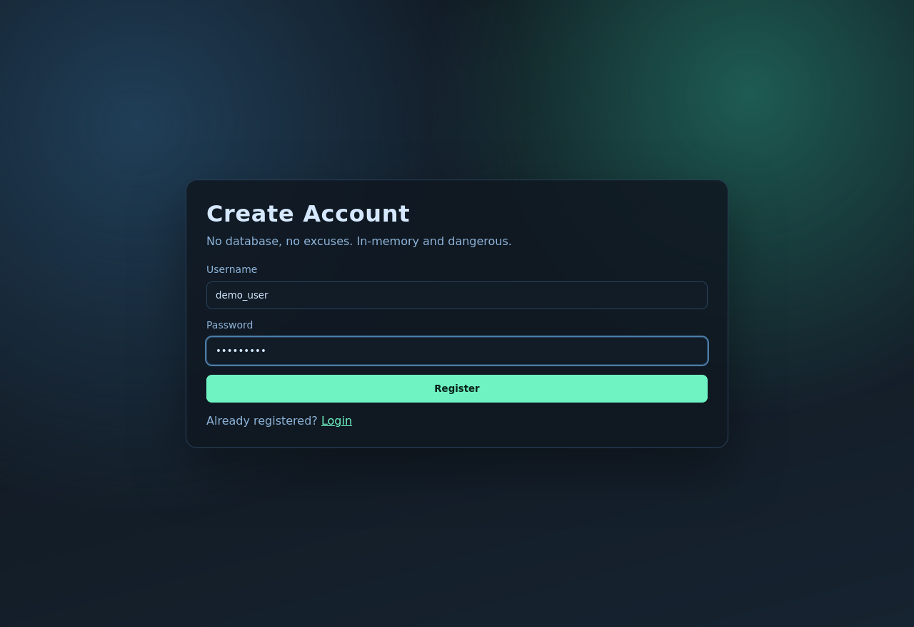
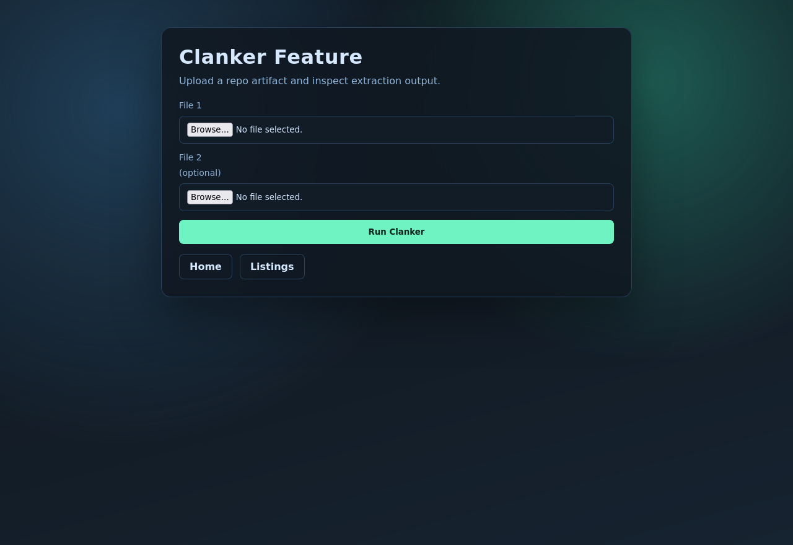
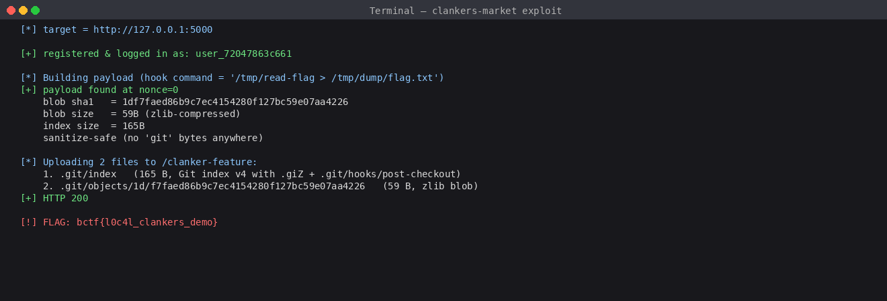
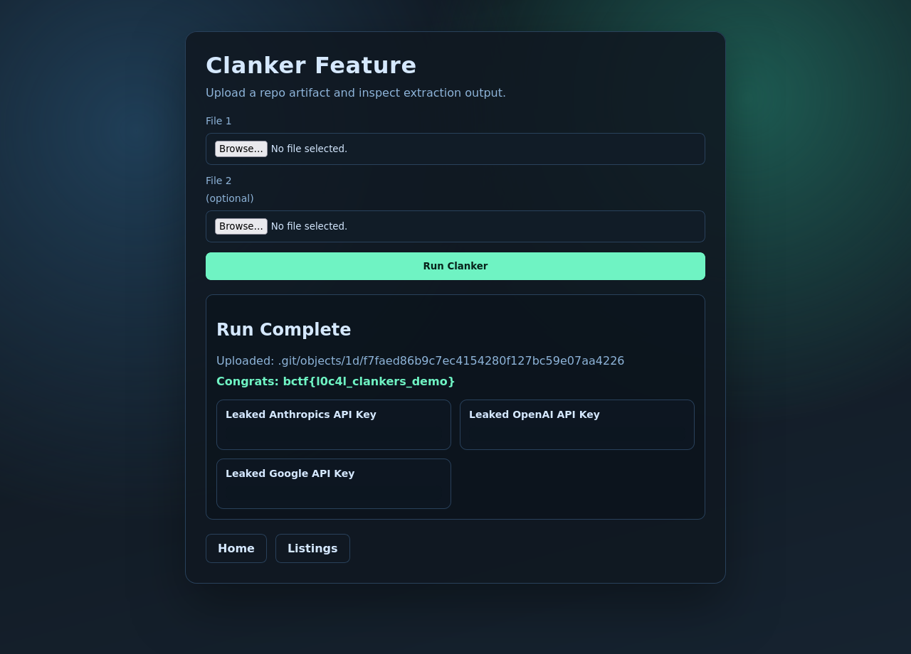

# clankers-market — B01lers CTF 2026 (Web)

> Source đề: [`./challenge/`](./challenge) · Exploit: [`./solve.py`](./solve.py)

## Tóm tắt hướng giải

Web cho upload file, server vô tình chạy `git checkout` lên thư mục có file của mình. Git có cơ chế hook - script tự chạy khi `checkout`. Nếu mình nhét được hook trước khi `checkout` chạy, command trong hook sẽ chạy với quyền của server, và mình bảo nó "đọc file flag rồi ghi sang chỗ web đọc được". Cái khó là server có một bước dọn dẹp xoá hết file có chữ "git" trong nội dung - nên phải viết file `.git/index` (file Git nội bộ) sao cho không chứa chữ "git" mà Git vẫn parse được. Trick: xài Git index version 4 có path compression --> bytes thực không có "git" liên tiếp.

## 1. Mô tả challenge

- Web Flask **"Clankers Market"**: register/login, listing fake (mô phỏng leak API key), trang `/clanker-feature` cho upload tối đa 2 file.
- Sau khi upload, server tự tạo Git repo, chạy `git-dumper`, in kết quả lên web.
- Mục tiêu: lấy flag thật trong `/flag.txt`.

> Lưu ý: `flag.txt` trong repo do server tự tạo (dạng `bctf{steal_...}`) chỉ là **mồi nhử**, không phải flag thật.






Form upload đúng 2 file chính là **hint**: bài này cần đúng 2 file.

## 2. Đọc source - luồng xử lý của `/clanker-feature`

Trong `app.py`:

```python
file_path = os.path.join(WORKDIR, file.filename)
normalized_path = os.path.abspath(file_path)
if not normalized_path.startswith(WORKDIR + os.sep):
    return "That vuln in the big 26?"   # 403
```

`WORKDIR = /tmp/git_storage`. Check chỉ chặn path traversal kiểu `../../etc/passwd` ra ngoài WORKDIR - nhưng filename là `.git/index` thì normalize ra `/tmp/git_storage/.git/index`, vẫn nằm trong WORKDIR. Hợp lệ.

--> Mình ghi đè được file Git nội bộ.

Sau đó server chạy:

```python
setup_git_storage()                  # git init, commit ban đầu
# Lưu 2 file user upload vào WORKDIR (sau khi git init xong)
sanitize()                           # dọn dẹp
quickie_server(WORKDIR)              # mở HTTP server tại :12345 phục vụ WORKDIR
run_command("git-dumper http://localhost:12345 /tmp/dump")
# Đọc /tmp/dump/flag.txt và in ra web
```

Điểm quan trọng: upload xảy ra sau `git init`, nên thư mục `.git/` đã tồn tại sẵn. Mình ghi đè được file trong đó.

## 3. `sanitize()` làm gì

```python
run_command("rm -rf .git/hooks")
run_command(r"grep -rlZ 'git' . | xargs -0 rm -f --")   # xoá file có chữ "git"
run_command("find . -type f -name '*.py' -delete")
run_command("find . -type f -name '*.sh' -delete")
# ...
```

> Hook bị xoá, file có byte `git` (kể cả binary) cũng bị xoá. Nên upload `.git/hooks/post-checkout` thẳng không dùng được.

Hướng đi: không tự bỏ hook vào server local, mà ép `git checkout` (chạy bên trong `git-dumper`) tự tạo hook ở máy đích `/tmp/dump`.

## 4. Vì sao `git-dumper` lại chạy `git checkout`

`git-dumper` là tool tải toàn bộ `.git` được expose trên web rồi chạy `git checkout .` để dựng lại worktree. Nếu repo dump về có `.git/hooks/post-checkout` (executable), Git tự chạy nó luôn sau checkout.

> Mục tiêu: ép Git bên trong `git-dumper` tạo file `/tmp/dump/.git/hooks/post-checkout` với nội dung mình muốn.

## 5. Trick - sửa `.git/index`

`.git/index` là "bảng danh sách file" của Git, nó nói cho Git biết "path A lấy nội dung từ object hash X, path B từ Y". Khi `git checkout .`, Git đọc index rồi sinh file ra worktree theo bảng này.

Nếu mình tự tạo `.git/index` chỉ định:

```
path = .git/hooks/post-checkout  -->  object = <hash của script độc>
```

Thì lúc `git-dumper` tải về và `git checkout`, Git sẽ tự đẻ ra file hook rồi chạy luôn.

File index gồm 2 phần:

- Header `DIRC` + version + count.
- N entry, mỗi entry là metadata + sha1 của blob + tên path.

Mình cần đúng 2 file upload (vừa khớp limit 2 của web):

| Upload | Tác dụng |
|---|---|
| `.git/index` | Bảng danh sách ép Git checkout file gì |
| `.git/objects/xx/yyyy...` | Loose object (blob zlib-compressed) chứa script hook |

## 6. Né `sanitize()` bằng Git index v4

Vấn đề: nếu ghi path `.git/hooks/post-checkout` vào `.git/index` dạng raw thì file `.git/index` chứa substring `git` --> dính `grep` xoá.

Git index version 4 có path compression: tên path entry sau được lưu kiểu "xoá N ký tự cuối tên entry trước, nối suffix". Tham khảo [git-scm.com/docs/index-format](https://git-scm.com/docs/index-format).

Mình làm 2 entry:

```
Entry 1:  path = ".giZ"
Entry 2:  path = ".git/hooks/post-checkout"
        nén thành: remove_len=1, suffix="t/hooks/post-checkout"
```

Bytes thực trong file `.git/index`:

```
... '.giZ' '\x00' ...               (entry 1)
... '\x01' 't/hooks/post-checkout' '\x00' ...   (entry 2)
```

> Không có substring `git` liên tiếp --> `grep 'git'` không bắt --> file sống.

> Lúc Git đọc lại index v4: ghép `'.giZ'[:3]` + `'t/hooks/post-checkout'` = `'.git/hooks/post-checkout'`. Git hiểu đúng.

## 7. Vẫn phải né `git` trong loose object

`grep` chạy đệ quy luôn cả binary, nên blob `.git/objects/xx/yyyy` (zlib-compressed) cũng có thể tình cờ chứa `git`. Giải pháp: thêm comment `# nonce` vào script và brute đến khi cả `index` lẫn `loose_object` đều không chứa `git`:

```python
for nonce in range(0x10000):
    script = f"#!/bin/sh\n{command}\n# {nonce}\n".encode()
    sha_hex, loose_object = git_blob(script)
    index_data = build_index_v4(sha_hex, len(script))
    if b"git" in loose_object or b"git" in index_data:
        continue
    return index_data, sha_hex, loose_object
```

Demo của mình nonce=0 ra liền, không cần lặp.

## 8. Flag thật nằm ở đâu

Trong `Dockerfile`:

```dockerfile
RUN printf '%s\n' 'bctf{kill_bill_2}' > /flag.txt && \
    chown root:root /flag.txt && \
    chmod 400 /flag.txt
```

--> `/flag.txt` chỉ root đọc được. Nhưng có 1 SUID helper:

```dockerfile
gcc -O2 -o /usr/local/bin/read-flag /tmp/readflag.c
RUN chown root:web /usr/local/bin/read-flag && chmod 4750 /usr/local/bin/read-flag
```

> User `web` (web app chạy bằng user này) có quyền chạy `/usr/local/bin/read-flag`, helper in nội dung `/flag.txt` ra stdout.

Vậy hook chỉ cần:

```sh
/usr/local/bin/read-flag > /tmp/dump/flag.txt
```

Server đọc `/tmp/dump/flag.txt` (dòng `with open("/tmp/dump/flag.txt", "r") as f:`) rồi render lên web --> mình thấy flag.

## 9. Exploit hoàn chỉnh

Code đầy đủ ở [`./solve.py`](./solve.py). Chạy:

```bash
pip install requests
python3 solve.py http://CHALL_HOST:5000
```

## 10. Chạy local

Mình dựng web cùng source ở local + một SUID giả `/tmp/read-flag` đọc một file `/tmp/local_flag.txt`. Chạy:



Trang web sau khi exploit thành công hiển thị flag ở dòng "Congrats":



## 11. Flag

```
lâu quá mình quên flag rồi
```

(local demo: `bctf{l0c4l_clankers_demo}`)

## 12. Tổng kết lỗ hổng

| | Lỗ hổng | Chi tiết |
|---|---|---|
| 1 | Upload vào `.git/` | check path chỉ chặn ra ngoài WORKDIR, không chặn ghi đè file Git |
| 2 | Server chạy `git-dumper` trên repo có user-controlled file | mình kiểm soát một phần Git internal |
| 3 | `git-dumper` chạy `git checkout .` | có thể trigger hook `post-checkout` |
| 4 | sanitize bằng `grep 'git'` | dễ bypass với index v4 path compression |
| 5 | Có sẵn helper SUID `read-flag` | execute = leak flag |

## 13. Bài học rút ra

- Không cho user upload file vào thư mục có sẵn `.git/`, dù đã chống path traversal kiểu cổ điển.
- Không chạy `git-dumper` (hay bất kỳ tool nào tự `git checkout`) trên dữ liệu do user control.
- Sanitize bằng `grep` rất dễ bypass - Git index v4, encode, nén, đủ kiểu né được.
- Git hook biến mọi thao tác `checkout/commit/push` thành command execution nếu attacker control được repo.
- Đọc source CTF nhớ để ý thứ tự xử lý: bài này upload xảy ra sau `git init` mới có chỗ chèn payload.

### Tham khảo

- Git index format: <https://git-scm.com/docs/index-format>
- Git hooks: <https://git-scm.com/docs/githooks>
- git-dumper: <https://github.com/arthaud/git-dumper>
